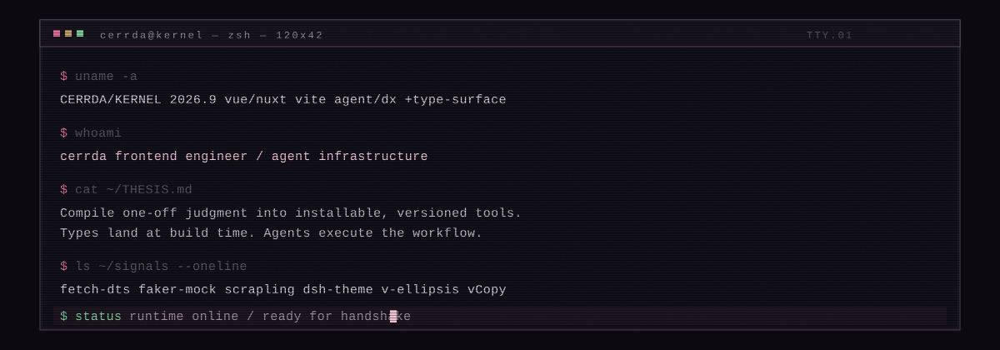
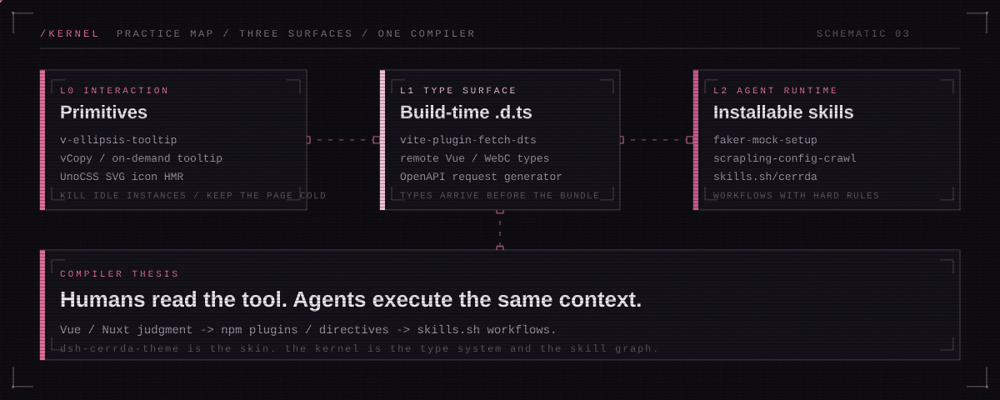

<p align="center">
  
</p>
<p align="center">
  
</p>
<p align="center">
  
</p>

<br/>

```
CERRDA :: FRONTEND ENGINEER
FOCUS  :: agent infrastructure / developer experience
THESIS :: compile judgment into installable tools
BIO    :: see less and learn more
```

把一次性的工程判断压成可安装、可版本化的接口。远程组件的类型在 Vite 构建期就位；Mock 联调与采集流程写成 Agent 能执行的 Skill；中后台里那些被复制一百遍的交互，收成一条指令。少看热闹，多把能力写成协议。

<br/>

## `/signals`

| ID  | SURFACE         | ARTIFACT                                                                                     | ROLE                                        |
| :-- | :-------------- | :------------------------------------------------------------------------------------------- | :------------------------------------------ |
| 01  | type / build    | [`vite-plugin-fetch-dts`](https://www.npmjs.com/package/vite-plugin-fetch-dts)               | author · remote Vue / WebC `.d.ts` at build |
| 02  | request / api   | [`openapi-v3-request-generator`](https://www.npmjs.com/package/openapi-v3-request-generator) | contributor · OpenAPI → request layer       |
| 03  | agent / mock    | [`faker-mock-setup`](https://skills.sh/cerrda/skills/faker-mock-setup)                       | author · page-level Faker + MSW skill       |
| 04  | agent / harvest | [`scrapling-config-crawl`](https://skills.sh/cerrda/skills/scrapling-config-crawl)           | author · config-driven crawl skill          |
| 05  | skin / gui      | [`dsh-cerrda-theme`](https://www.npmjs.com/package/dsh-cerrda-theme)                         | author · DSH liquid-glass + Silk            |

```bash
pnpm add vite-plugin-fetch-dts
npx skills add https://github.com/cerrda/skills --skill faker-mock-setup
npx skills add https://github.com/cerrda/skills --skill scrapling-config-crawl
```

<br/>

## `/field-notes`

工程判断的原文。不写教程体，写可复用的接口怎么被压出来。

- [把团队 Mock 工作流做成可安装 Skill](https://juejin.cn/post/7672434949261197352)
- [配置驱动采集：scrapling-config-crawl](https://juejin.cn/post/7672698563611197490)
- [Vite 远程类型：vite-plugin-fetch-dts 的构建期补全](https://www.npmjs.com/package/vite-plugin-fetch-dts)
- [UnoCSS 自定义 SVG 图标热更新](https://juejin.cn/post/7653373167660204078)
- [一个指令干掉页面上 200 个无用 Tooltip](https://juejin.cn/post/7637342611919880228)
- [v-ellipsis-tooltip：只在真正溢出时出现](https://juejin.cn/post/7597704040216215578)
- [vCopy：一行指令完成复制](https://juejin.cn/post/7650080459327373354)
- [DSH 液态玻璃丝绸主题](https://juejin.cn/post/7674840998541443118)

更多 → [掘金 / Cerrda](https://juejin.cn/user/2564487822453831/posts)

<br/>

## `/channels`

```
MAIL     cerrda728@gmail.com
GITHUB   github.com/Cerrda
SITE     cerrda.github.io/cerrda
SKILLS   skills.sh/cerrda
JUEJIN   juejin.cn/user/2564487822453831
STACK    Vue · Nuxt · Vite · TypeScript · Agent Skills
```

<p align="center">
  <a href="mailto:cerrda728@gmail.com">邮箱</a>
  ·
  <a href="https://github.com/Cerrda">GitHub</a>
  ·
  <a href="https://cerrda.github.io/cerrda/">站点</a>
  ·
  <a href="https://skills.sh/cerrda">skills.sh</a>
  ·
  <a href="https://juejin.cn/user/2564487822453831/posts">掘金</a>
</p>

<p align="center">
  <sub>CERRDA.SYS · SEE LESS AND LEARN MORE · UNIT / C-01</sub>
</p>
