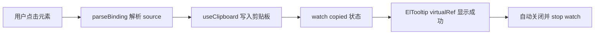

# 一行指令搞定复制：Vue 3 vCopy 实现解析

**Meta description:** 从 `src/directives/copy.ts` 出发，详解如何用 VueUse useClipboard + Element Plus 虚拟 Tooltip 实现带成功反馈的 `v-copy` 指令，并处理 Clipboard API 兼容与资源清理。

---

## 钩子：复制功能谁都会写，但体验往往差一点

后台系统里「复制订单号」「复制链接」几乎无处不在。`navigator.clipboard.writeText()` 三行代码就能复制，但用户点击后往往没有任何反馈——不知道有没有成功，也不知道复制了什么。

更麻烦的是：**Clipboard API 在非 HTTPS 或旧浏览器上并不可靠**，Tooltip 若直接包在目标元素外面，又会破坏原有布局。本文从本仓库的 `src/directives/copy.ts` 出发，拆解一套「点哪复制哪、成功有提示、卸载不泄漏」的指令方案。

---

## 背景：为什么不用 `<el-button @click="copy()">`？

封装成指令而不是 composable + 按钮，是因为复制场景高度重复：

| 场景 | 典型写法 | 痛点 |
|------|----------|------|
| 表格单元格 | 点击整格复制 | 每个 cell 都要绑事件、调 API、弹提示 |
| 文本 + 图标 | `<span>xxx <i /></span>` | 包裹 Tooltip 会改变 DOM 结构 |
| 动态内容 | 订单号来自接口 | 需要响应式 source，且不能重复触发 |

指令把「解析 source → 写入剪贴板 → 显示成功反馈 → 清理副作用」收敛到一处，模板侧只需 `v-copy` 或 `v-copy="'xxx'"`，心智负担最低。

项目通过 `unplugin-auto-import` 自动注册 `src/directives/**` 下的导出，因此 **`vCopy` 无需手动 import**，在任意 `.vue` 模板里直接写 `v-copy` 即可。

---

## 核心设计：四层协作

整体数据流如下：



### 1. WeakMap 管理指令上下文

每个绑定元素在 `mounted` 时创建 `CopyContext`，存入 `WeakMap<HTMLElement, CopyContext>`：

```ts
interface CopyContext {
  container?: HTMLElement   // render() 挂载 Tooltip 的容器
  vm?: VNode                // ElTooltip 虚拟节点
  binding: DirectiveBinding<CopyValue>
  onClick: () => void
  stopWatcher?: WatchStopHandle
  copied?: boolean          // 防止 copied 期间重复点击
}
```

`WeakMap` 以 DOM 元素为键，元素被 GC 时上下文一并释放，避免全局 Map 泄漏。`beforeUnmount` 里移除监听、`render(null)` 卸载 Tooltip、停止 `watch`，保证路由切换后不留幽灵节点。

### 2. 灵活的 binding 解析

`parseBinding` 支持四种传值方式，覆盖绝大多数业务场景：

```ts
// 1. 字符串 — 复制固定内容
<span v-copy="'SN20250612001'">复制 SN</span>

// 2. 不传值 — 复制元素 textContent
<span v-copy>{{ row.orderNo }}</span>

// 3. Ref — 点击时读取最新值
<span v-copy="orderId">复制</span>

// 4. 配置对象 — 完整控制
<span v-copy="{ source: link, tooltip: false, onSuccess: (s) => ElMessage.success(s) }">
  复制链接
</span>
```

对象形式继承 `UseClipboardOptions`（含 `legacy`）和 `UseTooltipProps`（含 `placement`、`effect` 等），可按需覆盖 Tooltip 样式或关闭成功提示。

### 3. VueUse useClipboard + legacy 降级

```ts
const { copy, copied } = useClipboard({ legacy: true, ...copyOptions })
copy(copyOptions.source!)
```

`legacy: true` 会在 Clipboard API 不可用时回退到 `document.execCommand('copy')`，对 iframe 嵌入、内网 HTTP 环境更友好。`copied` 是响应式布尔值，复制成功后变为 `true`，便于驱动 UI 反馈。

### 4. 虚拟 Tooltip：不包裹 DOM，只「锚定」元素

这是与 `vEllipsisTooltip` 共享的模式。关键 props：

```ts
h(ElTooltip, {
  virtualTriggering: true,  // 不渲染 trigger 子节点
  virtualRef: el,             // 锚定到指令绑定的 DOM
  visible: false,             // 手动控制显隐
  placement: 'top',
  effect: 'light',
  ...copyOptions,
}, {
  content: () => h('div', { class: 'flex items-center gap-2 text-success' }, [
    h('div', { class: 'i-custom-confirm-circle-filled text-14' }),
    '复制成功',
  ]),
})
```

**为什么用 `virtualTriggering`？** 若在指令里把目标元素包进 `<ElTooltip>`，会改变原有 DOM 层级，表格、flex 布局容易错位。虚拟触发让 Tooltip 的 Popper 浮层独立渲染，目标元素保持原样。

成功内容用 `render()` 挂到离屏 `div`，并通过 `binding.instance.$.appContext` 继承当前应用上下文，确保 Element Plus 主题与 i18n 生效：

```ts
if (binding.instance && binding.instance.$) {
  vm.appContext = binding.instance.$.appContext
}
```

显隐通过 exposed 方法手动驱动：

```ts
watch(copied, (newVal, oldVal) => {
  ctx.copied = newVal
  ctx.vm?.component?.exposed?.[newVal ? 'onOpen' : 'onClose']?.()
  if (!newVal && oldVal) {
    ctx.stopWatcher?.()
  }
})
```

复制成功 → `onOpen` 显示「复制成功」；状态回落 → `onClose` 并停止监听，避免 watcher 常驻。

---

## 完整源码

以下是 `src/directives/copy.ts` 的完整实现，可直接复制到项目中使用（依赖 VueUse、Element Plus、lodash-es，并通过 auto-import 自动注入 `h`、`watch`、`useClipboard` 等 API）：

```ts
// @unocss-include
import type { UseClipboardOptions } from '@vueuse/core'
import type { UseTooltipProps } from 'element-plus'
import type { Directive, WatchStopHandle } from 'vue'
import { ElTooltip } from 'element-plus'
import { isPlainObject } from 'lodash-es'
import { render } from 'vue'

interface CopyOptions extends UseClipboardOptions<string>, Partial<UseTooltipProps> {
  tooltip?: boolean
  onSuccess?: (source: string) => void
}

type CopyValue = MaybeRef<string> | CopyOptions

interface CopyContext {
  container?: HTMLElement
  vm?: VNode
  binding: DirectiveBinding<CopyValue>
  onClick: () => void
  stopWatcher?: WatchStopHandle
  copied?: boolean
}

const contextMap = new WeakMap<HTMLElement, CopyContext>()

const parseBinding = (el: HTMLElement, binding: DirectiveBinding<CopyValue>) => {
  const { value } = binding
  let copyOptions: CopyOptions = { legacy: true, tooltip: true }

  if (typeof value === 'string') {
    copyOptions.source = value
  }
  else if (isRef(value)) {
    copyOptions.source = value.value
  }
  else if (!value) {
    copyOptions.source = el.textContent ?? ''
  }
  else if (isPlainObject(value)) {
    copyOptions = { ...copyOptions, ...value, source: value.source ?? el.textContent ?? '' }
  }

  return copyOptions
}

const clean = (ctx: CopyContext) => {
  ctx.stopWatcher?.()
  if (ctx.container) {
    render(null, ctx.container)
    ctx.container.remove()
  }
  ctx.vm = undefined
  ctx.container = undefined
}

const handleClick = (el: HTMLElement, ctx: CopyContext) => {
  if (ctx.copied) {
    return
  }

  const { binding } = ctx
  const copyOptions = parseBinding(el, binding)

  if (copyOptions.tooltip && !ctx.vm) {
    const vm = h(ElTooltip, {
      virtualTriggering: true,
      virtualRef: el,
      placement: 'top',
      effect: 'light',
      // 手动控制 tooltip 的显示和隐藏
      visible: false,
      ...copyOptions,
    }, {
      content: () => h('div', { class: 'flex items-center gap-2 text-success' }, [
        h('div', { class: 'i-custom-confirm-circle-filled text-14' }),
        '复制成功',
      ]),
    })

    if (binding.instance && binding.instance.$) {
      vm.appContext = binding.instance.$.appContext
    }

    ctx.vm = vm
  }
  if (copyOptions.tooltip && !ctx.container) {
    ctx.container = document.createElement('div')
  }
  if (copyOptions.tooltip && ctx.vm && ctx.container) {
    render(ctx.vm, ctx.container)
  }

  const { copy, copied } = useClipboard({ legacy: true, ...copyOptions })

  ctx.stopWatcher?.()
  ctx.stopWatcher = watch(copied, (newVal, oldVal) => {
    ctx.copied = newVal
    ctx.vm?.component?.exposed?.[newVal ? 'onOpen' : 'onClose']?.()
    if (!newVal && oldVal) {
      ctx.stopWatcher?.()
    }
  })

  copy(copyOptions.source!).then(() => copyOptions.onSuccess?.(copyOptions.source!))
}

/** 复制内容到剪贴板 */
export const vCopy: Directive<HTMLElement, CopyValue> = {
  mounted(el: HTMLElement, binding: DirectiveBinding<CopyValue>) {
    const ctx: CopyContext = {
      binding,
      onClick: () => handleClick(el, ctx),
    }
    contextMap.set(el, ctx)

    el.addEventListener('click', ctx.onClick)
  },

  updated(el: HTMLElement, binding: DirectiveBinding<CopyValue>) {
    const ctx = contextMap.get(el)
    if (ctx) {
      ctx.binding = binding
    }
  },

  beforeUnmount(el: HTMLElement) {
    const ctx = contextMap.get(el)!
    el.removeEventListener('click', ctx.onClick)
    clean(ctx)
    contextMap.delete(el)
  },
}
```

---

## 实践：在项目里怎么用

### 步骤 1：表格单元格一键复制

```vue
<el-table-column label="订单号" prop="orderNo">
  <template #default="{ row }">
    <span
      v-copy="row.orderNo"
      class="cursor-pointer text-primary hover:underline"
    >
      {{ row.orderNo }}
    </span>
  </template>
</el-table-column>
```

点击即复制，`source` 在点击时从 binding 解析，无需在 script 里写 `copy` 函数。

### 步骤 2：复制当前元素文本

省略 `value` 时，指令回退到 `el.textContent`：

```vue
<code v-copy class="select-all">{{ apiKey }}</code>
```

适合「所见即所复制」的展示型文本。

### 步骤 3：自定义成功回调

不需要 Tooltip、改用 ElMessage 时：

```vue
<span v-copy="{ source: email, tooltip: false, onSuccess: () => ElMessage.success('邮箱已复制') }">
  {{ email }}
</span>
```

### 步骤 4：与 UnoCSS 图标联动

成功提示里的 `i-custom-confirm-circle-filled` 来自项目 `presetIcons` 本地 SVG 集合（前缀 `custom`）。在 `h()` 渲染函数里同样可以用原子类，文件顶部的 `// @unocss-include` 确保 UnoCSS 扫描到这些类名。详见 [UnoCSS 图标方案](/blogs/unocss-icons-solution/post.md) 一文。

---

## 实现细节与常见坑

**防重复点击：** `ctx.copied` 为 `true` 时 `handleClick` 直接 return，避免连续点击触发多个 Tooltip 实例。VueUse 默认 `copiedDuring: 1500`，约 1.5 秒内 `copied` 保持 `true`，与 Tooltip 显示窗口一致。

**updated 钩子只更新 binding：** 不在 `updated` 里重建 Tooltip，而是在每次点击时按需 `parseBinding`，保证动态 source 始终最新。

**模板 Ref 会被自动解包：** `v-copy="orderId"` 在指令里拿到的往往是字符串而非 `Ref`。若需追踪 Ref 后续变化，应传对象形式 `v-copy="{ source: orderId }"`。

**用户手势必须在同步栈内：** `copy()` 须在 `click` 回调的同步调用栈里执行。若在 `await fetchText()` 之后才调用，可能丢失瞬态用户激活，导致静默失败。

**指令内 watch 不会自动停止：** 不在组件 `setup` 作用域内的 `watch`（Vue [#8034](https://github.com/vuejs/core/issues/8034)）必须在 `copied` 复位或 `beforeUnmount` 时手动 `stopWatcher()`。

**清理顺序：** `beforeUnmount` → 移除 `click` 监听 → `render(null, container)` → `container.remove()` → `stopWatcher()`。顺序错误可能导致内存泄漏或控制台警告。

**与 `v-debounce` 叠加：** 本仓库 `v-debounce` 在捕获阶段拦截连点，可能与 `v-copy` 冲突。同元素并用时注意事件顺序，或把防抖逻辑内聚到 copy 指令。

**HTTPS 与权限：** 即使用 `legacy: true`，部分 WebView 仍可能失败。可为 `copy()` 增加 `.catch()`，失败时用 ElMessage 提示用户手动复制。

**SSR：** 指令仅在客户端 `mounted` 后访问 `document` 与剪贴板，不会在服务端执行，无需额外 guard。

---

## 与同类指令的分工

本仓库 `src/directives/` 下还有 `vEllipsisTooltip`、`vDebounce`、`vPermission` 等。其中 **`vEllipsisTooltip` 与 `vCopy` 共用同一套虚拟 Tooltip 模式**，区别仅在于触发时机（`mouseenter` vs `click`）和内容逻辑（溢出检测 vs 复制成功）。理解一个，另一个几乎可以直接读懂。

---

## 总结

- **`v-copy` 指令** 把复制 + 成功反馈封装为一行模板语法，通过 auto-import 全局可用
- **`useClipboard({ legacy: true })`** 兼顾现代 Clipboard API 与旧环境降级
- **ElTooltip `virtualTriggering`** 在不破坏 DOM 结构的前提下，给任意元素挂上浮动反馈
- **WeakMap + 完整 unmount 清理** 保证 SPA 路由切换后不泄漏 watcher 与 render 容器

---

## 下一步

1. 在表格或详情页给高频复制字段加上 `v-copy`，统一交互体验
2. 阅读 [VueUse useClipboard 文档](https://vueuse.org/core/useClipboard/) 了解 `read`、权限检测等扩展能力
3. 若团队需要「复制失败」提示，在 `handleClick` 里为 `copy()` 增加 `.catch()` 并接入 ElMessage

---
